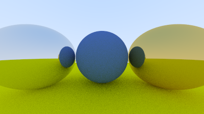

## Overview
This repository contains a ray tracer implementation based on the book [Ray Tracing in One Weekend](https://raytracing.github.io/books/RayTracingInOneWeekend.html) along with animations created by combining many ray traced images using the ffmpeg command line tool. 
#### Orbits of mercury, venus, earth, mars, and the moon

#### Moving camera angle

## Ray Tracing
Ray tracing is the process of modelling the behaviour of light in a virtual environment. This involves sending out rays from a plane that represents a camera’s point of view and determining the colour to assign the pixel where the ray originated based on the interaction of the ray with objects in the scene. The purpose is to render accurate and detailed images with low manual efforts. Ray tracing is commonly used in the making of animated movies and video games.

## Project Process
The book goes over the basics of ray tracing in terms of object creation, reflection and refraction of rays, vector math, antialiasing, ‘camera’ positioning, and more, which enable the creation of ray traced images of spheres in a 3D-appearing space. The spheres are customizable in terms of their size, location, material (reflection, refraction, absorption). The images folder of this repository has several images I created by ray tracing to determine the colour of each pixel (some images shown below).

Using the ray tracing structure learned in the book, I created more static images. I then created animations by combining images with incremental changes, and through making new classes/other changes where needed. Below are some more of my animations.

